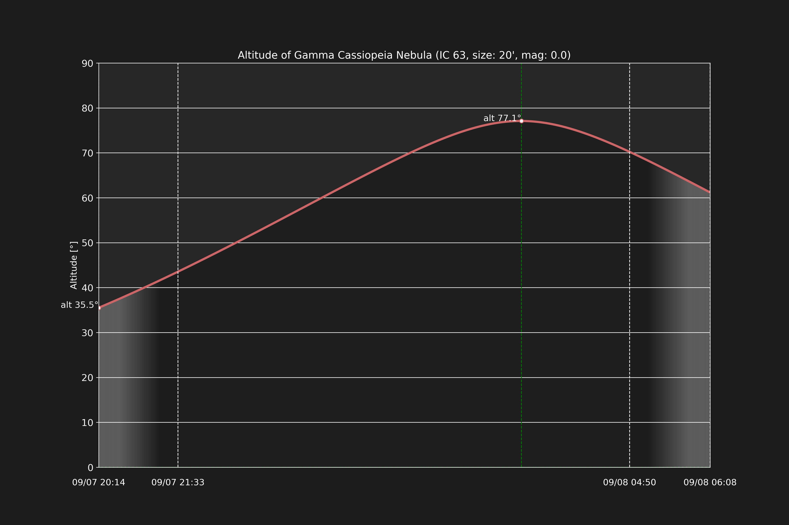
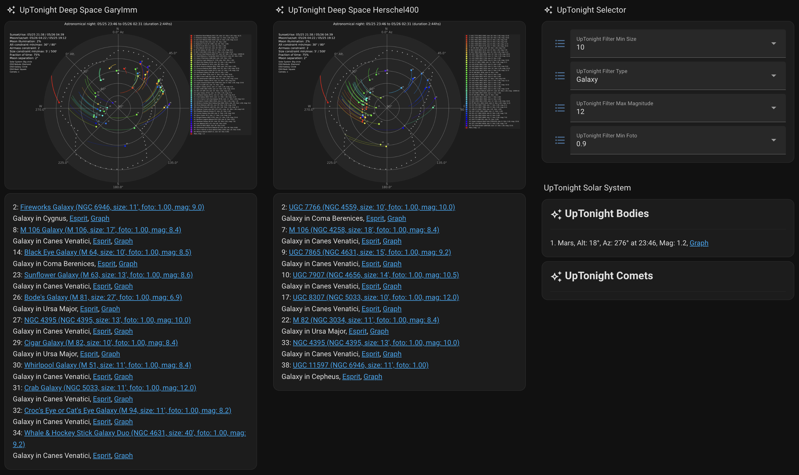

# UpTonight<!-- omit in toc -->


[](http://www.astropy.org/)
[](https://rhodesmill.org/skyfield/)

UpTonight calculates the best astrophotography targets for the night at a given location. The default target list for deep sky objects is a merge of Gary Imm's [My Top 100 Astrophotography Targets](https://www.astrobin.com/uc8p37/) and the top 200 from his incredible [Deep Sky Compendium](http://www.garyimm.com/compendium). In addition, UpTonight calculates the observability of the solar system bodies. Finally, it can calculate the brightest visible comets based on the [Minor Planet Center](https://www.minorplanetcenter.net/data) database.

***UpTonight calculates Deep Sky Objects, Solar System Bodies and Comets!***

UpTonight generates a plot of the sky in addition to a report on today's destinations. Below is the year 2025 starting with June for Munich:


***One more thing:*** You can easily integrate UpTonight with Home Assistant via MQTT!

If you want, you can [buy me a coffee](https://buymeacoffee.com/markus_winkler), I would really appreciate it!

## Table of Content<!-- omit in toc -->

- [How it Works](#how-it-works)
  - [Deep Sky Objects](#deep-sky-objects)
  - [Solar System Bodies](#solar-system-bodies)
  - [Comets](#comets)
  - [Altitude vs. Time Diagrams](#altitude-vs-time-diagrams)
- [How to Run](#how-to-run)
  - [Python Script](#python-script)
  - [Container](#container)
- [Configuration](#configuration)
  - [Environment variables](#environment-variables)
  - [Config file](#config-file)
  - [Lovelace Configuration](#lovelace-configuration)
  - [Automatic Daily Calculations](#automatic-daily-calculations)

## How it Works

Logically, the calculation is done as follows:

1. Specify your scope location based on it's Earth location, time zone, and optional environmental parameters of temperature, relative humidity, and air pressure. The environmental parameters are required for the refraction calculation.
2. Calculate the nearest astronomical sunset and sunrise for the location. If you are at a latitude where the sun may not go below -18°, UpTonight will try to use nautical and possibly civil darkness.
3. Horizon:
   1. If defined calculate your horizon.
4. Deep Sky Objects:
   1. Calculate observable objects within your altitude and air mass constraints.
   2. Filter the remaining objects to fit within the size and fraction of time observability limits.
5. Solar System:
   1. Calculate the Sun, Moon, and planets (bodies) if observable.
   2. Compute the maximum altitude for the bodies.
6. Comets:
   1. Compute comet positions and distances.
   2. Compute the visual magnitudes and coordinates.
   3. Filter for brightest and observable comets.
7. Create plot and reports.

The plot contains all objects within the given constraints during your possible observation period.

### Deep Sky Objects

You can change the constraints by configuring them in the `config.yaml` (the constraints are ignored for solar system bodies):

1. Maximum Airmass (default 2): Airmass is a measure of the amount of air along the line of sight when observing a star or other celestial source from below Earth's atmosphere. There are many different ways to calculate this, in the current implementation the airmass is approximated by the secant of the zenith angle (max airmass set to 2 means 60° below the zenith, 2 = 1/cos(60))
2. Minimum and maximum altitude.
3. Size constraints in arc minutes.
4. Minimum fraction of time observable for the object. The default value of 0.8 means that the given objects must be within your constraints for at least 80% of astronomical darkness.
5. Moon separation in degrees.

The report for the objects includes the following information:

- Your configured observatory location
- The observation period for this night of astronomical darkness
- The percentage of moon illumination
- The constraints defined for the calculation
- The objects table:
  - Target name
  - Location in hms dms
  - Right ascension and declination in degree
  - Altitude and azimuth at oberservation start time in degree
  - The date and time of an eventual meridian or antimeridian transit
  - Object type
  - Constellation
  - Object size in arc minutes
  - Visual magnitude of the object when available
  - Fraction of time observable

**Available Target Lists for Deep Sky Objects**

List | Description | Objects
---- | ----------- | -------
GaryImm *(default)*| A merge of Gary Imm's [My Top 100 Astrophotography Targets](https://www.astrobin.com/uc8p37/) and the top 200 taken from his [Deep Sky Compendium](http://www.garyimm.com/compendium). | 208
Messier | All 110 official Messier objects. | 110
Herschel400 | The Herschel 400 - 400 of the best objects from the NGC list as selected by the Astronomical League. | 400
OpenIC | The Index Catalogue (IC) based on [OpenNGC](https://github.com/mattiaverga/OpenNGC) | 5589
OpenNGC | The New General Catalogue (NGC) based on [OpenNGC](https://github.com/mattiaverga/OpenNGC) | 8373
LDN | Lynds Catalog of Dark Nebulae based on [NASA](https://heasarc.gsfc.nasa.gov/W3Browse/nebula-catalog/ldn.html) | 1802
LBN | Lynds Catalog of Bright Nebulae based on [NASA](https://heasarc.gsfc.nasa.gov/W3Browse/nebula-catalog/lbn.html) | 1116

### Solar System Bodies

The bodies are defined within `uptonight/const.py`. The constraints set for deep sky objects are *not* applied to the bodies.

```py
# Solar System
BODIES = [
    ("Sun", "sun", "gold", 250),
    ("Moon", "moon", "lightgrey", 150),
    ("Mercury", "mercury", "pink", 20),
    ("Venus", "venus", "rosybrown", 30),
    ("Mars", "mars", "red", 30),
    ("Jupiter", "jupiter", "chocolate", 50),
    ("Saturn", "saturn", "khaki", 45),
    ("Uranus", "uranus", "lightsteelblue", 20),
    ("Neptune", "neptune", "royalblue", 15),
]
```

Report contents for the bodies:

- The bodies table:
  - Target name
  - Location in hms dms
  - Right ascension and declination in degree
  - Altitude (max) and azimuth at maximum altitude time in degree
  - Visual magnitude
  - The date and time of an eventual meridian or antimeridian transit
  - Object type
  - Fraction of time observable

### Comets

The visual magnitude limit is defined in `uptonight/const.py`. The constraints set for deep sky objects are *not* applied to the comets. Civil sunset and sunrise are used as the possible observation period.

```py
# Default magnitude limit (comets)
DEFAULT_MAGNITUDE_LIMIT = 12
```

Report contents for the comets:

- The comets table:
  - Target name
  - Distance to the Earth in AU
  - Distance to the Sun in AU
  - Absolute and visual magnitute
  - Altitude and azimuth at observation start time
  - Rise and set time

**Used Target List for Comets**

List | Description | Objects
---- | ----------- | -------
CometsEls | The up to date comet database maintained by the [Minor Planet Center](https://www.minorplanetcenter.net/data). | 1168 (as of 09/18/24)

### Altitude vs. Time Diagrams

If you enable the UpTonight feature `alttime` in your config file an altitude vs time diagram is created for each observable deep sky object, body, and comet. This is only supported if *not* running in live mode.



## How to Run

There are two ways to run UpTonight. As a regular Python script or as a container.

### Python Script

To calculate the best targets for your location set the following environment variables:

```sh
# Here center of Munich
export LONGITUDE=11d34m51.50s
export LATITUDE=48d08m10.77s
export ELEVATION=519
export TIMEZONE=Europe/Berlin
```

To run UpTonight simply do the following:

```sh
# just once
pip install -r requirements.txt

# run
python3 main.py
```

The plot and the report will be located in the `out`-diretory.

> ***Note:*** You must use UTF-8 mode with Python on Windows! Enable it by setting the environment variable `PYTHONUTF8=1` before running UpTonight.

### Container

You can also run uptonight as a container. To build the image, run

```sh
docker build -t uptonight .
```

To run it

```sh
# Without refraction calculations
docker run --rm \
  -e LONGITUDE=11d34m51.50s \
  -e LATITUDE=48d08m10.77s \
  -e ELEVATION=519 \
  -e TIMEZONE=Europe/Berlin \
  -v ./out:/app/out \
  uptonight
```

The plot and the report will be located in the `./out`-diretory.

> ***Note:*** Running UpTonight as a container is my preferred way of using it.

***Docer Compose:*** Alternative example for docker-compose, here writing to the `www`-directory of Home Assistant and using my published image on Docker Hub:

```yaml
services:
  uptonight:
    image: mawinkler/uptonight:latest
    container_name: uptonight
    environment:
      - LONGITUDE=11d34m51.50s
      - LATITUDE=48d08m10.77s
      - ELEVATION=519
      - TIMEZONE=Europe/Berlin
    volumes:
      - /home/smarthome/homeassistant/www:/app/out
```

Alternative using the `config.yaml` (see below):

```yaml
services:
  uptonight:
    image: mawinkler/uptonight:latest
    container_name: uptonight
    volumes:
      - /home/smarthome/uptonight/config.yaml:/app/config.yaml
      - /home/smarthome/homeassistant/www:/app/out
```

## Configuration

Configuration is done via a yaml-based configuration file and/or environment variables.

> ***Note:*** An environment variable overrides the config file setting.

> ***Note:*** All settings are optional. If not set, defaults will be used. The only mandatory settings are the longitude and latitude of your location. Set them either via environment variables or in the config file.

Examples of minimal configuration:

```sh
export LONGITUDE="11d34m51.50s"
export LATITUDE="48d08m10.77s"
```

### Environment variables

Variable | Unit | Description | Example | Optional | Default
-------- | ---- | ----------- | ------- | -------- | -------
LONGITUDE | dms | Longitude in degrees minutes seconds | 11d34m51.50s
LATITUDE | dms | Latitude in degrees minutes seconds | 48d08m10.77s
ELEVATION | m | Height above sea level in meters | 519
TIMEZONE | tz | TZ timezone | "Europe/Berlin"
PRESSURE | bar | The ambient pressure | 1.022 | yes | 0
RELATIVE_HUMIDITY | percentage | The ambient relative humidity | 0.8| yes | 0
TEMPERATURE | degrees centigrade | The ambient temperature | 12| yes | 0
OBSERVATION_DATE | %m/$d/%y | Day of observation | 10/01/23 | yes | *Current day*
TARGET_LIST | string | Any of the provided target lists (GaryImm, Hershel400, Messier) | "targets/Messier" | yes | "targets/GaryImm"
TYPE_FILTER | string | Filter on an object type | Nebula | yes | ""
OUTPUT_DIR | string | Output directory for reports and the plot | "/tmp" | yes | "."
LIVE_MODE | *bool* | Run in live mode, generate plot every five minutes.<br>Bash doesn't support boolean variables, but the code checks for the word 'true'. | true | yes | false
TARGET | string | Calculate only the named deep sky object. This must be in the selected target list or in your custom targets. | "NGC 2359" | yes | not set

UpTonight supports a ***live*** mode as well. Contrary to the normal mode where the calculations are done and the output is generated for the upcoming night you'll get a live plot. To enable this mode set `LIVE_MODE=true`. In this mode, UpTonight will create a file called `uptonight-liveplot.png` every five minutes but no `txt`, or `json`-reports.

### Config file

All keys besides `location.longitude` and `location.latitude` are optional.

```yaml
observation_date: # Date in the format MM/DD/YY (e.g. 01/27/25)
target_list: targets/GaryImm
type_filter: # e.g. Galaxy, Nebula 
output_dir: out
live_mode: false

# An optional prefix for the file names.
# Example: uptonight-PREFIX-plot.png
# prefix: PREFIX

# Include a datestamp in the output file names.
# output_datestamp: false

# Configure your mqtt broker for the reports and the plot.
# Useful for an easy Home Assistant integration (see below).
# mqtt:
#   host: 192.168.1.100
#   port: 1883
#   user:
#   password:
#   clientid: uptonight

# Enable or disable festures
features:
  # Plot the horizon baesd on `horizon.anchor_points`.
  horizon: true  
  # Calculate and plot deep sky objects based on the chosen target list.
  objects: true  
  # Calculate and plot solar sysstem bodies.
  bodies: true  
  # Calculate and plot comets.
  comets: true  
  # Calculate and plot altitude vs time diagrams.
  alttime: true  

# Layout of the plot.
# Allowed values: landscape / portrait
# layout: landscape

# Set your location here. Longitude and latitude in DMS, elevation in metres.
location:
  longitude: 11d34m51.50s
  latitude: 48d08m10.77s
  elevation: 519
  timezone: Europe/Berlin

# Environmental conditions.
environment:
  pressure: 1.022
  temperature: 18
  relative_humidity: 0.7

constraints:
  altitude_constraint_min: 30  # in deg above horizon
  altitude_constraint_max: 80  # in deg above horizon
  airmass_constraint: 2  # 30° to 90°, 2 = 1/cos(60) 
  size_constraint_min: 10  # in arc minutes
  size_constraint_max: 300  # in arc minutes

  # Fixed minimum moon separation in degrees
  moon_separation_min: 45  # in degrees

  # If set to true, moon_separation_min is derived from the moon illumination
  # Percentage and overwrites moon_separation_min. 1% corresponds 1°.
  moon_separation_use_illumination: true

  # Object needs to be within the constraints for at least 50% of darkness
  fraction_of_time_observable_threshold: 0.5

  # Maximum number of targets to calculate
  max_number_within_threshold: 60

  # true : Meaning that azimuth is shown increasing counter-clockwise (ccw), or with north
  #        at top, east at left, etc.
  # false: Show azimuth increasing clockwise (cw).
  north_to_east_ccw: false

# Personal bucket list to always include. Use the name attribute for identification
bucket_list:
  - IC 434
  - NGC 2359
  - M 16

done_list:
  - IC 1795
  - LBN 535

# Custom Targets (see below)
custom_targets:
  - name: NGC 4395
    description: NGC 4395
    type: Galaxy
    constellation: Canes Venatici
    size: 13
    ra: 12 25 48
    dec: +33 32 48
    mag: 10.0
  - name: NGC 3227
    description: Galaxy duo NGC 3226
    type: Galaxy
    constellation: Leo
    size: 4
    ra: 10 23 30
    dec: +19 51 54
    mag: 10.4
  - name: LBN 105
    description: SH2-73
    type: Molecular Cloud
    constellation: Hercules
    size: 75
    ra: 16 11 7.6
    dec: +21 52 26.4
    mag: 0

# Horizon (see below)
horizon:
  # Step size in degrees
  step_size: 5
  # Anchor points of the horizon
  # Should start with an azimuth of 0 and end with 360 degrees
  anchor_points:
    - alt: 20
      az: 0
    - alt: 20
      az: 52
    - alt: 30
      az: 60
    - alt: 49
      az: 90
    - alt: 52
      az: 135
    - alt: 21
      az: 150
    - alt: 16
      az: 176
    - alt: 14
      az: 222
    - alt: 34
      az: 241
    - alt: 20
      az: 267
    - alt: 28
      az: 330
    - alt: 31
      az: 343
    - alt: 20
      az: 360
```

***MQTT:*** UpTonight can send the results and the plot to an MQTT broker. This covers everything except Altitude vs. Time diagrams. If you're using Home Assistant it does support auto configuration of the created UpTonight Sensor and Camera. Since the sensor attribute size is limited by Home Assistant, some attributes are removed before sending the data to the broker. Additionally, limit the total number of deep-sky objects to around 45, including those on your bucket list.

***Bucket- and Done Lists:*** You can create a bucket list of objects which will allways show (if visible) ignoring the constraints. Similar is the done list, but in the opposite way. These targets are ignored. Use the `name` key for identification.

***Custom Targets:*** If you want to add your own objects to the calculation. Example:

```yaml
custom_targets:
  - name: NGC 4395
    description: NGC 4395
    type: Galaxy
    constellation: Canes Venatici
    size: 13
    ra: 12 25 48
    dec: +33 32 48
    mag: 10.0
  - name: NGC 3227
    description: Galaxy duo NGC 3226
    type: Galaxy
    constellation: Leo
    size: 4
    ra: 10 23 30
    dec: +19 51 54
    mag: 10.4
```

***Horizon:*** Optionally, you can plot a custom horizon for your location (white dotted line). For this, define the altitude / azimuth pairs as shown in the config example below. I did use this [digital angle meter](https://amzn.eu/d/gE778vk) from Amazon which I placed on my tripod with a compass next to it.


### Lovelace Configuration

Below is my current Lovelace configuration to achieve this:



I'm currently doing the calculation based on the two target lists *GaryImm* and *Herschel400*.

Camera (Plot) for GaryImm:

```yaml
show_state: false
show_name: false
camera_view: live
type: picture-entity
entity: camera.uptonight_backyard_objects_garyimm_plot
camera_image: camera.uptonight_backyard_objects_garyimm_plot
aspect_ratio: 1.5:1
tap_action:
  action: fire-dom-event
  browser_mod:
    service: browser_mod.popup
    data:
      title: GaryImm
      size: wide
      content:
        type: picture-entity
        entity: camera.uptonight_backyard_objects_garyimm_plot
        camera_image: camera.uptonight_backyard_objects_garyimm_plot
        aspect_ratio: 1.5:1
        show_state: true
        show_name: false
        camera_view: live
```

Sensor (Report):

```yaml
type: markdown
content: >
  
  
  <table><tr>
  {%- set astrobin = '%22' + item.id | regex_replace('\s', '%20') + '%22' %}
  
  {{ loop.index }}: <a href="https://astrobin.com/search/?q={{ astrobin }}">{{
  item["target name"] }}</a><br>{{ item.type }} in {{ item.constellation }},
  <a href="https://astrobin.com/search/?q={{ astrobin
  }}&d=i&subject=&telescope=&camera=&integration_time_min=0&integration_time_max=16&telescope_focal_length_min=600&telescope_focal_length_max=850&color_or_mono=C&telescope_diameter_min=100&telescope_diameter_max=130&sort=-likes">Esprit</a>,
  <a href="http://192.168.1.129:8123/local/uptonight-garyimm/uptonight-alttime-{{
  alttime }}.png" target="_blank" rel="noopener noreferrer">Graph</a>
  </tr></table>
  
  
  Waiting for UpTonight
  
```

Below a more advanced variant (which I am using) with support for Dropdown List Helpers:

```yaml
type: markdown
content: >
  
  
  
  
  
  
  <table><tr>
  {%- set astrobin = '%22' + item.id | regex_replace('\s', '%20') + '%22' %}
  
  {{ loop.index }}: <a href="https://astrobin.com/search/?q={{ astrobin }}">{{
  item["target name"] }}</a><br>{{ item.type }} in {{ item.constellation }},
  <a href="https://astrobin.com/search/?q={{ astrobin
  }}&d=i&subject=&telescope=&camera=&integration_time_min=0&integration_time_max=16&telescope_focal_length_min=600&telescope_focal_length_max=850&color_or_mono=C&telescope_diameter_min=100&telescope_diameter_max=130&sort=-likes">Esprit</a>,
  <a href="http://192.168.1.129:8123/local/uptonight-garyimm/uptonight-alttime-{{
  alttime }}.png" target="_blank" rel="noopener noreferrer">Graph</a>
  </tr></table>
  
  
  
  
  
  
  Waiting for UpTonight
  
```

Input selects:

```yaml
type: entities
entities:
  - entity: input_select.uptonight_filter_min_size
  - entity: input_select.uptonight_filter_type
  - entity: input_select.uptonight_filter_max_magnitude
  - entity: input_select.uptonight_filter_min_foto
```

I defined the input selects as helpers using the below options:

Types | Min Size | Min Foto | Max Magnitude
----- | -------- | -------- | -------------
Asterism | 3 | 0.5 | 0
Dark Nebula | 10 | 0.6 | 6
Emission Nebula | 30 | 0.7 | 10
Galaxy | 60 | 0.8 | 18
Galaxy Cluster | | 0.9
Galaxy Duo | | 1.0
Galaxy Group
Globular Cluster
Molecular Cloud
Nova
Open Cluster
Planetary Nebula
Preplanetary Nebula
Reflection Nebula
Supernova Remnant
Variable Star
Wolf-Rayet Nebula
All

### Automatic Daily Calculations

I recommend crontab and docker-compose for this:

```crontab
0 12 * * * /usr/bin/docker compose -f /home/smarthome/docker-compose.yaml up uptonight-garyimm
5 12 * * * /usr/bin/docker compose -f /home/smarthome/docker-compose.yaml up uptonight-herschel400
```

My `docker-compose.yaml`:

```yaml
  uptonight-garyimm:
    image: mawinkler/uptonight:dev
    container_name: uptonight-garyimm
    environment:
      - TARGET_LIST=targets/GaryImm
    volumes:
      - /home/smarthome/uptonight/config.yaml:/app/config.yaml
      - /home/smarthome/homeassistant/www/uptonight-garyimm:/app/out

  uptonight-herschel400:
    image: mawinkler/uptonight:dev
    container_name: uptonight-herschel400
    environment:
      - TARGET_LIST=targets/Herschel400
    volumes:
      - /home/smarthome/uptonight/config.yaml:/app/config.yaml
      - /home/smarthome/homeassistant/www/uptonight-herschel400:/app/out
```

Clear Skies!