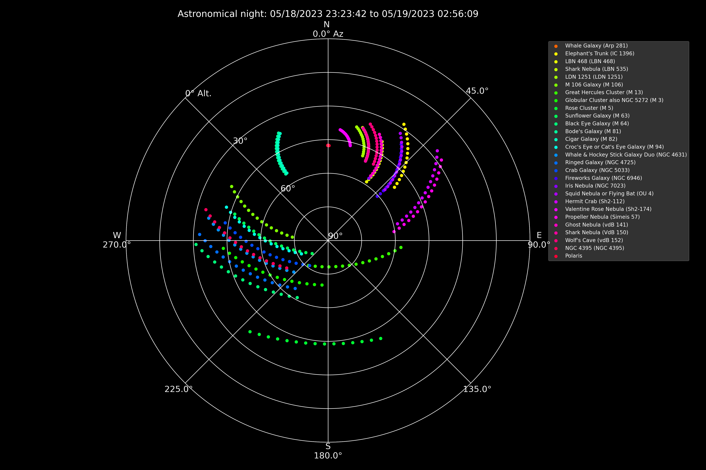

# UpTonight<!-- omit in toc -->

[](http://www.astropy.org/)

UpTonight calculates the best astro photography targets for the night at a given location. The default built in target list is a merge of Gary Imm's [My Top 100 Astrophotography Targets](https://www.astrobin.com/uc8p37/) and the top 200 taken from his incredible [Deep Sky Compendium](http://www.garyimm.com/compendium).

UpTonight creates a plot of the sky in addition to a report about todays targets. Below an example output for Munich in the night from the 18th to 19th of May:



Example report:

```txt
-------------------------------------------------------------------------------------------------------------------------------------------------------------------
Up tonight
-------------------------------------------------------------------------------------------------------------------------------------------------------------------

Observatory: Backyard
 - Location: 11.58 deg, 48.14 deg, 519.00 m

Observation timespan: 05/18/2023 23:23:42 to 05/19/2023 02:56:09
Moon illumination: 1%
Contraints: Altitude constraint minimum: 30, maximum: 80, Airmass constraint: 2, Size constraint minimum: 10, maximum: 180
Altitude and Azimuth calculated for 05/18/2023 23:23:42

                               target name               hmsdms right ascension declination altitude azimuth    meridian transit antimeridian transit              type  constellation  size foto
------------------------------------------ -------------------- --------------- ----------- -------- ------- ------------------- -------------------- ----------------- -------------- ----- ----
                Elephant's Trunk (IC 1396) 21h38m58s +57d29m21s           324.8        57.5     28.1    33.1                                                Dark Nebula        Cepheus  60.0  0.9
              Propeller Nebula (Simeis 57) 20h16m10s +43d40m11s           304.0        43.7     28.0    54.5                                            Emission Nebula         Cygnus  20.0  0.9
                     Hermit Crab (Sh2-112) 20h33m49s +45d38m00s           308.5        45.6     27.0    50.5                                            Emission Nebula         Cygnus  15.0  0.9
                   Sunflower Galaxy (M 63) 13h15m49s +42d01m46s           199.0        42.0     80.8   230.9                                                     Galaxy Canes Venatici  13.0  0.9
                    Whale Galaxy (Arp 281) 12h41m59s +32d34m00s           190.5        32.6     69.2   227.5                                                     Galaxy Canes Venatici  15.0  1.0
                    Shark Nebula (VdB 150) 22h09m40s +73d23m25s           332.5        73.4     37.5    17.3                                          Reflection Nebula        Cepheus  11.0  1.0
                    Ghost Nebula (vdB 141) 21h16m27s +68d15m52s           319.0        68.2     37.3    25.8                                          Reflection Nebula        Cepheus  20.0  1.0
           Valentine Rose Nebula (Sh2-174) 23h47m08s +80d49m22s           356.8        80.8     40.3     6.2                                           Planetary Nebula        Cepheus  10.0  1.0
         Squid Nebula or Flying Bat (OU 4) 21h11m47s +59d57m01s           318.0        59.9     32.4    33.9                                            Emission Nebula        Cepheus  60.0  1.0
                    Iris Nebula (NGC 7023) 21h01m36s +68d10m10s           315.5        68.2     38.4    26.9                                          Reflection Nebula        Cepheus  60.0  1.0
               Fireworks Galaxy (NGC 6946) 20h34m52s +60d09m14s           308.8        60.2     36.1    37.2                                                     Galaxy         Cygnus  11.0  1.0
                    Crab Galaxy (NGC 5033) 13h13m28s +36d35m38s           198.4        36.6     76.1   216.4                                                     Galaxy Canes Venatici  11.0  1.0
                  Ringed Galaxy (NGC 4725) 12h50m27s +25d30m03s           192.6        25.5     64.1   214.5                                                     Galaxy Coma Berenices  11.0  1.0
Whale & Hockey Stick Galaxy Duo (NGC 4631) 12h42m08s +32d32m29s           190.5        32.5     69.2   227.4                                                     Galaxy Canes Venatici  40.0  1.0
     Croc's Eye or Cat's Eye Galaxy (M 94) 12h50m53s +41d07m12s           192.8        41.1     76.7   243.4                                                     Galaxy Canes Venatici  11.0  1.0
                       Cigar Galaxy (M 82) 09h55m53s +69d40m50s           149.0        69.7     54.8   328.8                                                     Galaxy     Ursa Major  10.0  1.0
                      Bode's Galaxy (M 81) 09h55m33s +69d03m56s           148.9        69.1     54.8   327.5                                                     Galaxy     Ursa Major  27.0  1.0
                   Black Eye Galaxy (M 64) 12h56m44s +21d40m58s           194.1        21.7     61.1   208.4                                                     Galaxy Coma Berenices  10.0  1.0
                        Rose Cluster (M 5) 15h18m33s +02d04m57s           229.6         2.1     40.4   151.8 05/19/2023 00:47:59                       Globular Cluster        Serpens  17.0  1.0
      Globular Cluster also NGC 5272 (M 3) 13h42m11s +28d22m35s           205.5        28.4     70.0   187.8                                           Globular Cluster Canes Venatici  16.0  1.0
             Great Hercules Cluster (M 13) 16h41m41s +36d27m35s           250.4        36.5     57.4    95.4 05/19/2023 02:10:32                       Globular Cluster       Hercules  32.0  1.0
                      M 106 Galaxy (M 106) 12h18m58s +47d18m16s           184.8        47.3     74.0   275.5                                                     Galaxy Canes Venatici  17.0  1.0
                       LDN 1251 (LDN 1251) 22h36m03s +75d15m35s           339.0        75.2     37.7    14.1                                                Dark Nebula        Cepheus  90.0  1.0
                    Shark Nebula (LBN 535) 22h14m55s +73d25m00s           333.8        73.4     37.3    17.0                                          Reflection Nebula        Cepheus  15.0  1.0
                         LBN 468 (LBN 468) 20h42m29s +67d51m00s           310.5        67.9     39.7    28.5                                            Molecular Cloud        Cepheus 120.0  1.0
                     Wolf's Cave (vdB 152) 22h14m02s +69d56m00s           333.5        69.9     34.8    19.9                                          Reflection Nebula        Cepheus  60.0  1.0
                       NGC 4395 (NGC 4395) 12h25m48s +33d32m48s           186.5        33.5     67.9   236.4                                                     Galaxy Canes Venatici  13.0  1.0
```

## Table of Content<!-- omit in toc -->

- [How it Works](#how-it-works)
- [How to Run](#how-to-run)
  - [Configuration](#configuration)
  - [Constraints](#constraints)
  - [Available Target lists](#available-target-lists)
  - [Python Script](#python-script)
  - [Container](#container)
- [Adding Custom Objects](#adding-custom-objects)

## How it Works

Logically, the calculation is done as follows:

1. Specify your scope location based on the it's earth location, timezone and optionally environmental parameters temperature, rel. humidity and air pressure. Environment parameters are required for refraction calculation.
2. Calculate nearest astronomical sunset and sunrise for the location. If you are at a latitude where the sun might not go below -18° UpTonight tries to use nautical and eventually civil darkness.
3. Calculate the oberservable objects while respecting your altitude and airmass constraints.  
   You can modify the constraints by configuring them in `uptonight/const.py`:
      1. Maximum airmass (default 2): Airmass is a measure of the amount of air along the line of sight when observing a star or other celestial source from below Earth's atmosphere. There are many different ways to calculate this, in the current implementation the airmass is approximated by the secant of the zenith angle (max airmass set to 2 means 60° down from zenith, 2 = 1/cos(60))
      2. Minimal and maximal altitude.
      3. Size constraints in arc minutes.
      4. Minimal fraction of time observable for the object. The default value of 0.8 means, that the given objects needs to be in your constraints for at least 80% of astronomical darkness.
      5. Moon separation in degrees.
4. Filter the remaining objects to fit in the size and fraction of time observability limits.
5. Create plot and report.

The plot contains all objects within the given constraints during your possible observation timespan. The distance in between the points represent 15 minutes of time.

The report contains the following information:

- Your configured observatory location
- The observation timespan for this night during astronomical darkness
- The Moon illumination in percentage
- The defined constraints for the calculation
- The objects table:
  - Target name
  - Location in hms dms
  - Right ascension and declination in degree
  - Altitude and azimuth at oberservation start time in degree
  - The date and time of an eventual meridian or antimeridian transit
  - Object type
  - Constellation
  - Object size in arc minutes
  - Fraction of time observable

## How to Run

There are two ways to run UpTonight. As a normal Python script or as a container.

### Configuration

Configuration is done by environment variables for now.

Variable | Unit | Description | Example | Optional | Default
-------- | ---- | ----------- | ------- | -------- | -------
LONGITUDE | dms | Longitude in degrees minutes seconds | 11d34m51.50s
LATITUDE | dms | Latitude in degrees minutes seconds | 48d08m10.77s
ELEVATION | m | Height above sea level in meters | 519
TIMEZONE | tz | TZ timezone | Europe/Berlin
PRESSURE | bar | The ambient pressure | 1.022 | yes | 0
RELATIVE_HUMIDITY | percentage | The ambient relative humidity | 0.8| yes | 0
TEMPERATURE | degrees centigrade | The ambient temperature | 12| yes | 0
OBSERVATION_DATE | %m/$d/%y | Day of observation | 10/01/23| yes | *Current day*
TARGET_LIST | string | Any of the provided target lists (GaryImm, Hershel400, Messier) | targets/Messier | yes | targets/GaryImm
TYPE_FILTER | string | Filter on an object type | Nebula | yes | ""
OUTPUT_DIR | string | Output directory for reports and the plot | "/tmp" | yes | "."

### Constraints

If you want to change constraints adapt the constants below to your needs in `uptonight/const.py`

```py
ALTITUDE_CONSTRAINT_MIN = 20   # in deg above horizon
ALTITUDE_CONSTRAINT_MAX = 80   # in deg above horizon
AIRMASSS_CONSTRAINT = 2        # 30° to 90°
SIZE_CONSTRAINT_MIN = 10       # in arc minutes
SIZE_CONSTRAINT_MAX = 180      # in arc minutes
MOON_SEPARATION_MIN = 90       # in degrees

# object needs to be within the constraints for at least 80% of darkness
FRACTION_OF_TIME_OBSERVABLE_THRESHOLD = 0.80
```

### Available Target lists

List | Description | Objects
---- | ----------- | -------
GaryImm *(default)*| A merge of Gary Imm's [My Top 100 Astrophotography Targets](https://www.astrobin.com/uc8p37/) and the top 200 taken from his [Deep Sky Compendium](http://www.garyimm.com/compendium). | 208
Messier | All 110 official Messier objects. | 110
Herschel400 | The Herschel 400 - 400 of the best objects from the NGC list as selected by the Astronomical League. | 400

### Python Script

To calculate your best targets for your location set the following environment variables:

```sh
# Here center of Munich
export LONGITUDE=11d34m51.50s
export LATITUDE=48d08m10.77s
export ELEVATION=519
export TIMEZONE=Europe/Berlin
```

To run UpTonight simply do the following:

```sh
# just once
pip install -r requirements.txt

# run
python3 main.py
```

The plot and the report will be located in the `out`-diretory.

### Container

You can run uptonight as a container as well. To build the image run

```sh
docker build -t uptonight .
```

To run it

```sh
# Without refraction calculations
docker run --rm \
  -e LONGITUDE=11d34m51.50s \
  -e LATITUDE=48d08m10.77s \
  -e ELEVATION=519 \
  -e TIMEZONE=Europe/Berlin \
  -v ./out:/app/out \
  uptonight
```

The plot and the report will be located in the `./out`-diretory.

> ***Note:*** Running UpTonight as a container is my preferred way of using it.

Alternative example for docker-compose, here writing to the `www`-directory of Home Assistant and using my published image on Docker Hub:

```yaml
version: "3.2"
services:
  uptonight:
    image: mawinkler/uptonight:latest
    container_name: uptonight
    environment:
      - LONGITUDE=11d34m51.50s
      - LATITUDE=48d08m10.77s
      - ELEVATION=519
      - TIMEZONE=Europe/Berlin
      - PRESSURE=1.022
      - TEMPERATURE=18
      - RELATIVE_HUMIDITY=0.7
      # - TYPE_FILTER=Nebula
    volumes:
      - /home/smarthome/homeassistant/www:/app/out
```

## Adding Custom Objects

If you want to add your own objects to the calculation, simply add them to the list `CUSTOM_TARGETS` defined in `uptonight/const.py`. Example:

```py
    {
        "name": "NGC 3227",
        "common name": "Galaxy duo NGC 3226",
        "type": "Galaxy",
        "constellation": "Leo",
        "size": 4, # in arc minutes
        "ra": "10 23 30",
        "dec": "+19 51 54"
    },
```
