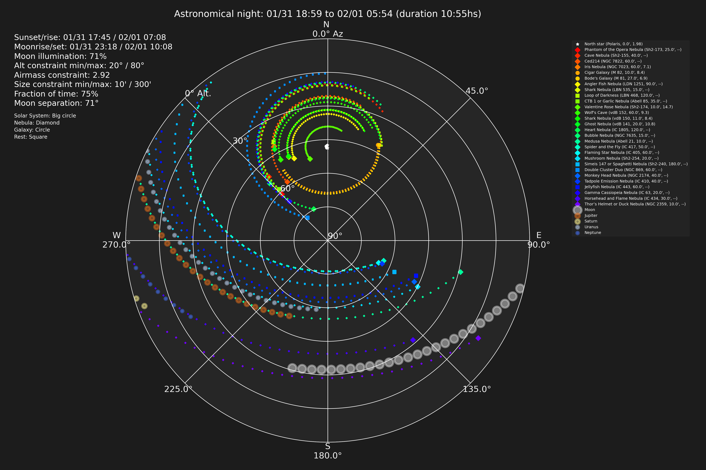

# UpTonight<!-- omit in toc -->

[](http://www.astropy.org/)

UpTonight calculates the best astro photography targets for the night at a given location. The default built in target list is a merge of Gary Imm's [My Top 100 Astrophotography Targets](https://www.astrobin.com/uc8p37/) and the top 200 taken from his incredible [Deep Sky Compendium](http://www.garyimm.com/compendium).

UpTonight creates a plot of the sky in addition to a report about todays targets. Below the year 2024 for Munich:


Example plot for 01/31/24:



Example report for 01/31/24:

```txt
-------------------------------------------------------------------------------------------------------------------------------------------------------------------
UpTonight
-------------------------------------------------------------------------------------------------------------------------------------------------------------------

Observatory: Backyard
 - Location: 11.58 deg, 48.14 deg, 519.00 m

Observation timespan: 01/31 18:59 to 02/01 05:54 in astronomical darkness
Moon illumination: 71%
Contraints: Altitude constraint minimum: 20°, maximum: 80°, Airmass constraint: 2.92, Moon separation constraint: 71°, Size constraint minimum: 10', maximum: 300'
Altitude and Azimuth calculated for 01/31 18:59

                                     target name               hmsdms right ascension declination altitude azimuth    meridian transit antimeridian transit              type constellation  size foto
------------------------------------------------ -------------------- --------------- ----------- -------- ------- ------------------- -------------------- ----------------- ------------- ----- ----
            Angler Fish Nebula (LDN 1251, 90.0') 22h36m03s +75d15m35s           339.0        75.2     50.4   337.8                      02/01/2024 02:07:06       Dark Nebula       Cepheus  90.0  1.0
    Phantom of the Opera Nebula (Sh2-173, 25.0') 00h21m16s +61d43m30s             5.3        61.7     61.0   315.5                      02/01/2024 03:52:55   Emission Nebula    Cassiopeia  25.0  1.0
          Valentine Rose Nebula (Sh2-174, 10.0') 23h47m08s +80d49m22s           356.8        80.8     52.8   347.8                      02/01/2024 03:18:30  Planetary Nebula       Cepheus  10.0  1.0
                   Iris Nebula (NGC 7023, 60.0') 21h01m36s +68d10m10s           315.5        68.2     41.7   330.5                      02/01/2024 00:32:44 Reflection Nebula       Cepheus  60.0  1.0
                      Cigar Galaxy (M 82, 10.0') 09h55m53s +69d40m50s           149.0        69.7     41.8    27.7 02/01/2024 01:28:42                                 Galaxy    Ursa Major  10.0  1.0
                        Ced214 (NGC 7822, 60.0') 00h03m36s +67d09m00s             0.9        67.1     58.2   325.5                      02/01/2024 03:35:13   Emission Nebula       Cepheus  60.0  1.0
                     Bode's Galaxy (M 81, 27.0') 09h55m33s +69d03m56s           148.9        69.1     41.6    28.4 02/01/2024 01:28:20                                 Galaxy    Ursa Major  27.0  1.0
                   Shark Nebula (LBN 535, 15.0') 22h14m55s +73d25m00s           333.8        73.4     48.9   335.0                      02/01/2024 01:45:58 Reflection Nebula       Cepheus  15.0  1.0
              Loop of Darkness (LBN 468, 120.0') 20h42m29s +67d51m00s           310.5        67.9     39.9   331.2                      02/01/2024 00:13:37   Molecular Cloud       Cepheus 120.0  1.0
                   Ghost Nebula (vdB 141, 20.0') 21h16m27s +68d15m52s           319.0        68.2     42.9   329.8                      02/01/2024 00:47:36 Reflection Nebula       Cepheus  20.0  1.0
                   Shark Nebula (vdB 150, 11.0') 22h09m40s +73d23m25s           332.5        73.4     48.5   335.0                      02/01/2024 01:40:42 Reflection Nebula       Cepheus  11.0  1.0
                    Wolf's Cave (vdB 152, 60.0') 22h14m02s +69d56m00s           333.5        69.9     48.3   329.8                      02/01/2024 01:45:15 Reflection Nebula       Cepheus  60.0  1.0
        CTB 1 or Garlic Nebula (Abell 85, 35.0') 23h59m54s +62d26m51s           360.0        62.4     58.4   316.5                      02/01/2024 03:31:31 Supernova Remnant    Cassiopeia  35.0  1.0
                    Cave Nebula (Sh2-155, 40.0') 22h57m54s +62d31m06s           344.5        62.5     51.3   317.2                      02/01/2024 02:29:24       Dark Nebula       Cepheus  40.0  1.0
                  Heart Nebula (IC 1805, 120.0') 02h32m47s +61d28m30s            38.2        61.5     74.6   335.8                                            Emission Nebula    Cassiopeia 120.0  1.0
                 Bubble Nebula (NGC 7635, 15.0') 23h20m45s +61d12m42s           350.2        61.2     53.8   314.5                      02/01/2024 02:52:18   Emission Nebula    Cassiopeia  15.0  0.9
                 Medusa Nebula (Abell 21, 10.0') 07h29m03s +13d14m48s           112.2        13.2     29.2   103.4 01/31/2024 23:01:35                       Planetary Nebula        Gemini  10.0  0.9
              Spider and the Fly (IC 417, 50.0') 05h28m06s +34d25m24s            82.0        34.4     63.5   109.8 01/31/2024 21:01:13                        Emission Nebula        Auriga  50.0  0.8
                Mushroom Nebula (Sh2-254, 20.0') 06h11m59s +18d03m18s            93.0        18.1     44.9   117.2 01/31/2024 21:44:47                        Emission Nebula         Orion  20.0  0.8
            Monkey Head Nebula (NGC 2174, 40.0') 06h09m24s +20d39m34s            92.4        20.7     47.3   115.5 01/31/2024 21:42:14                        Emission Nebula         Orion  40.0  0.8
                Jellyfish Nebula (IC 443, 60.0') 06h16m36s +22d31m00s            94.1        22.5     47.6   111.8 01/31/2024 21:49:26                      Supernova Remnant        Gemini  60.0  0.8
Simeis 147 or Spaghetti Nebula (Sh2-240, 180.0') 05h41m06s +28d05m00s            85.2        28.1     57.2   115.2 01/31/2024 21:14:06                      Supernova Remnant        Taurus 180.0  0.8
             Flaming Star Nebula (IC 405, 60.0') 05h16m29s +34d21m24s            79.1        34.3     65.3   113.6 01/31/2024 20:49:37                        Emission Nebula        Auriga  60.0  0.8
         Tadpole Emission Nebula (IC 410, 40.0') 05h22m44s +33d25m00s            80.7        33.4     63.7   113.2 01/31/2024 20:55:50                        Emission Nebula        Auriga  40.0  0.8
          Gamma Cassiopeia Nebula (IC 63, 20.0') 00h59m29s +60d54m42s            14.9        60.9     65.6   315.5                      02/01/2024 04:31:11   Emission Nebula    Cassiopeia  20.0  0.8
             Double Cluster Duo (NGC 869, 60.0') 02h19m00s +57d07m42s            34.8        57.1     76.4   318.5                      02/01/2024 05:50:44      Open Cluster       Perseus  60.0  0.8
      Horsehead and Flame Nebula (IC 434, 30.0') 05h41m00s -02d27m12s            85.2        -2.5     31.6   139.4 01/31/2024 21:13:41                            Dark Nebula         Orion  30.0  0.5
  Thor’s Helmet or Duck Nebula (NGC 2359, 10.0') 07h18m30s -13d13m36s           109.6       -13.2     10.0   123.0 01/31/2024 22:50:50                      Wolf-Rayet Nebula   Canis Major  10.0  0.5
```

## Table of Content<!-- omit in toc -->

- [How it Works](#how-it-works)
- [How to Run](#how-to-run)
  - [Configuration](#configuration)
  - [Available Target lists](#available-target-lists)
  - [Python Script](#python-script)
  - [Container](#container)
- [Adding Custom Objects](#adding-custom-objects)

## How it Works

Logically, the calculation is done as follows:

1. Specify your scope location based on the it's earth location, timezone and optionally environmental parameters temperature, rel. humidity and air pressure. Environment parameters are required for refraction calculation.
2. Calculate nearest astronomical sunset and sunrise for the location. If you are at a latitude where the sun might not go below -18° UpTonight tries to use nautical and eventually civil darkness.
3. Calculate the oberservable objects while respecting your altitude and airmass constraints.  
   You can modify the constraints by configuring them in `uptonight/const.py`:
      1. Maximum airmass (default 2): Airmass is a measure of the amount of air along the line of sight when observing a star or other celestial source from below Earth's atmosphere. There are many different ways to calculate this, in the current implementation the airmass is approximated by the secant of the zenith angle (max airmass set to 2 means 60° down from zenith, 2 = 1/cos(60))
      2. Minimal and maximal altitude.
      3. Size constraints in arc minutes.
      4. Minimal fraction of time observable for the object. The default value of 0.8 means, that the given objects needs to be in your constraints for at least 80% of astronomical darkness.
      5. Moon separation in degrees.
4. Filter the remaining objects to fit in the size and fraction of time observability limits.
5. Add the Sun, Moon and the planets, if observable.
6. Create plot and report.

The plot contains all objects within the given constraints during your possible observation timespan. The distance in between the points represent 15 minutes of time.

The report contains the following information:

- Your configured observatory location
- The observation timespan for this night during astronomical darkness
- The Moon illumination in percentage
- The defined constraints for the calculation
- The objects table:
  - Target name
  - Location in hms dms
  - Right ascension and declination in degree
  - Altitude and azimuth at oberservation start time in degree
  - The date and time of an eventual meridian or antimeridian transit
  - Object type
  - Constellation
  - Object size in arc minutes
  - Fraction of time observable

## How to Run

There are two ways to run UpTonight. As a normal Python script or as a container.

### Configuration

Configuration is done by a yaml based config file and/or environment variables.

> ***Note:*** An environment variable overwrites the setting in the config file.

> ***Note:*** All settings are optional. If not set default values are used. The only mandatory settings are the longitute and latitude of your location. Either set them via environment variables or within the config file.

Examples for a minimal configuration:

```sh
export LONGITUDE="11d34m51.50s"
export LATITUDE="48d08m10.77s"
```

or in `config.yaml`

```yaml
location:
  longitude: 11d34m51.50s
  latitude: 48d08m10.77s
```

***Environment variables***

Variable | Unit | Description | Example | Optional | Default
-------- | ---- | ----------- | ------- | -------- | -------
LONGITUDE | dms | Longitude in degrees minutes seconds | 11d34m51.50s
LATITUDE | dms | Latitude in degrees minutes seconds | 48d08m10.77s
ELEVATION | m | Height above sea level in meters | 519
TIMEZONE | tz | TZ timezone | Europe/Berlin
PRESSURE | bar | The ambient pressure | 1.022 | yes | 0
RELATIVE_HUMIDITY | percentage | The ambient relative humidity | 0.8| yes | 0
TEMPERATURE | degrees centigrade | The ambient temperature | 12| yes | 0
OBSERVATION_DATE | %m/$d/%y | Day of observation | 10/01/23 | yes | *Current day*
TARGET_LIST | string | Any of the provided target lists (GaryImm, Hershel400, Messier) | targets/Messier | yes | targets/GaryImm
TYPE_FILTER | string | Filter on an object type | Nebula | yes | ""
OUTPUT_DIR | string | Output directory for reports and the plot | "/tmp" | yes | "."
LIVE_MODE | *bool* | Run in live mode, generate plot every five minutes.<br>Bash doesn't support boolean variables, but the code checks for the word 'true'. | true | yes | false

UpTonight does support a ***live*** mode as well. Contrary to the normal mode where the calculations are done and output is created for the upcoming night you'll get a live plot. To activate this mode set `LIVE_MODE=true`. In this mode, UpTonight will create a file called `uptonight-liveplot.png` every five minutes but no `txt`, or `json`-reports.

***Config file `config.yaml`***

You can adapt the constraints within the config file now and don't need to change the `const.py` anymore.

```yaml
# observation_date: 03/28/24
target_list: targets/GaryImm
type_filter:  # e.g. Galaxy, Nebula 
output_dir: out
live_mode: false

location:
  longitude: 11d34m51.50s
  latitude: 48d08m10.77s
  elevation: 519
  timezone: Europe/Berlin

environment:
  pressure: 1.022
  temperature: 18
  relative_humidity: 0.7

constraints:
  altitude_constraint_min: 30  # In deg above horizon
  altitude_constraint_max: 80  # In deg above horizon
  airmass_constraint: 2  # 30° to 90°, 2 = 1/cos(60)
  size_constraint_min: 10  # In arc minutes
  size_constraint_max: 300  # In arc minutes

  moon_separation_min: 45  # In degrees

  # If set to true, moon_separation_min is derived from the moon illumination
  # percentage and overwrites moon_separation_min. 1% corresponds 1°.
  moon_separation_use_illumination: true

  # Object needs to be within the constraints for at least 50% of darkness.
  fraction_of_time_observable_threshold: 0.75

  # Maximum number of targets to calculate.
  max_number_within_threshold: 60

  # true : Meaning that azimuth is shown increasing counter-clockwise (ccw), or 
  #        with north at top, east at left, etc.
  # false: Show azimuth increasing clockwise (cw).
  north_to_east_ccw: false

# Personal bucket list to always include.
# Constraints are ignored for these targets.
bucket_list:
  - IC 434
  - NGC 2359

# Personal done list to always ignore.
done_list:
  - IC 1795
```

### Available Target lists

List | Description | Objects
---- | ----------- | -------
GaryImm *(default)*| A merge of Gary Imm's [My Top 100 Astrophotography Targets](https://www.astrobin.com/uc8p37/) and the top 200 taken from his [Deep Sky Compendium](http://www.garyimm.com/compendium). | 208
Messier | All 110 official Messier objects. | 110
Herschel400 | The Herschel 400 - 400 of the best objects from the NGC list as selected by the Astronomical League. | 400

### Python Script

To calculate your best targets for your location set the following environment variables:

```sh
# Here center of Munich
export LONGITUDE=11d34m51.50s
export LATITUDE=48d08m10.77s
export ELEVATION=519
export TIMEZONE=Europe/Berlin
```

To run UpTonight simply do the following:

```sh
# just once
pip install -r requirements.txt

# run
python3 main.py
```

The plot and the report will be located in the `out`-diretory.

### Container

You can run uptonight as a container as well. To build the image run

```sh
docker build -t uptonight .
```

To run it

```sh
# Without refraction calculations
docker run --rm \
  -e LONGITUDE=11d34m51.50s \
  -e LATITUDE=48d08m10.77s \
  -e ELEVATION=519 \
  -e TIMEZONE=Europe/Berlin \
  -v ./out:/app/out \
  uptonight
```

The plot and the report will be located in the `./out`-diretory.

> ***Note:*** Running UpTonight as a container is my preferred way of using it.

Alternative example for docker-compose, here writing to the `www`-directory of Home Assistant and using my published image on Docker Hub:

```yaml
version: "3.2"
services:
  uptonight:
    image: mawinkler/uptonight:latest
    container_name: uptonight
    environment:
      - LONGITUDE=11d34m51.50s
      - LATITUDE=48d08m10.77s
      - ELEVATION=519
      - TIMEZONE=Europe/Berlin
      - PRESSURE=1.022
      - TEMPERATURE=18
      - RELATIVE_HUMIDITY=0.7
      # - TYPE_FILTER=Nebula
    volumes:
      - /home/smarthome/homeassistant/www:/app/out
```

Alternative using the `config.yaml`:

```yaml
version: "3.2"
services:
  uptonight:
    image: mawinkler/uptonight:latest
    container_name: uptonight
    volumes:
      - /home/smarthome/uptonight/config.yaml:/app/config.yaml
      - /home/smarthome/homeassistant/www:/app/out
```

Simultaneously create live plots with the same config file:

```yaml
...
  uptonightlive:
    image: mawinkler/uptonight:latest
    container_name: uptonightlive
    environment:
      - LIVE_MODE=true
    volumes:
      - /home/smarthome/uptonight/config.yaml:/app/config.yaml
      - /home/smarthome/homeassistant/www:/app/out
    restart: always
```

## Adding Custom Objects

If you want to add your own objects to the calculation, simply add them to the list `CUSTOM_TARGETS` defined in `uptonight/const.py`. Example:

```py
    {
        "name": "NGC 3227",
        "common name": "Galaxy duo NGC 3226",
        "type": "Galaxy",
        "constellation": "Leo",
        "size": 4, # in arc minutes
        "ra": "10 23 30",
        "dec": "+19 51 54"
    },
```
