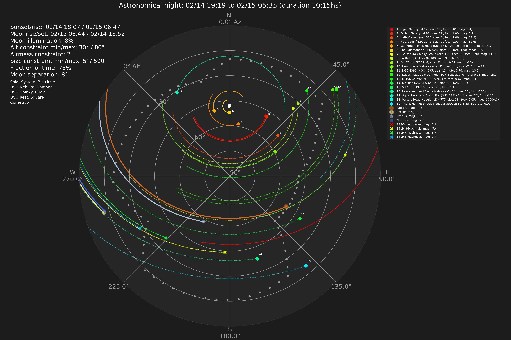

# UpTonight<!-- omit in toc -->


[](http://www.astropy.org/)
[](https://rhodesmill.org/skyfield/)


UpTonight calculates the best astrophotography targets for the night at a given location. The default target list for deep sky objects is a merge of Gary Imm's [My Top 100 Astrophotography Targets](https://www.astrobin.com/uc8p37/) and the top 200 from his incredible [Deep Sky Compendium](http://www.garyimm.com/compendium). In addition, UpTonight calculates the observability of the solar system bodies. Finally, it can calculate the brightest visible comets based on the [Minor Planet Center](https://www.minorplanetcenter.net/data) database.

- [How it Works](#how-it-works)
  - [Deep Sky Objects](#deep-sky-objects)
  - [Solar System Bodies](#solar-system-bodies)
  - [Comets](#comets)
- [How to Run](#how-to-run)
  - [Configuration](#configuration)
  - [Python Script](#python-script)
  - [Container](#container)
- [Adding Custom Objects](#adding-custom-objects)


UpTonight generates a plot of the sky in addition to a report on today's destinations. Below is the year 2024 starting with September for Munich:


Example report for 09/07/24:

```txt
-------------------------------------------------------------------------------------------------------------------------------------------------------------------
UpTonight
-------------------------------------------------------------------------------------------------------------------------------------------------------------------

Observatory: Backyard
 - Location: 11.58 deg, 48.14 deg, 519.00 m

Observation timespan: 09/07 21:33 to 09/08 04:50 in astronomical darkness
Moon illumination: 19%
Contraints: Altitude constraint minimum: 20°, maximum: 80°, Airmass constraint: 2.92, Moon separation constraint: 19°, Size constraint minimum: 3', maximum: 300'
Altitude and Azimuth calculated for 09/07 21:33

                                                      target name               hmsdms right ascension declination altitude azimuth    meridian transit antimeridian transit              type  constellation  size  mag foto
----------------------------------------------------------------- -------------------- --------------- ----------- -------- ------- ------------------- -------------------- ----------------- -------------- ----- ---- ----
                   Bubble Nebula (NGC 7635, size: 15', mag:  0.0) 23h20m45s +61d12m42s           350.2        61.2     55.3    45.7 09/08/2024 01:25:26                        Emission Nebula     Cassiopeia  15.0  0.0  1.0
                      Cave Nebula (Sh2-155, size: 40', mag:  0.0) 22h57m54s +62d31m06s           344.5        62.5     58.0    43.5 09/08/2024 01:02:32                            Dark Nebula        Cepheus  40.0  0.0  1.0
                       Bode's Galaxy (M 81, size: 27', mag:  6.9) 09h55m33s +69d03m56s           148.9        69.1     30.3   345.5                      09/08/2024 00:01:18            Galaxy     Ursa Major  27.0  6.9  1.0
                  Hourglass Nebula (Sh2-106, size: 3', mag:  0.0) 20h27m27s +37d22m49s           306.8        37.4     74.8   129.1 09/07/2024 22:32:25                        Emission Nebula         Cygnus   3.0  0.0  1.0
                     Cygnus Loop (Sh2-103, size: 180', mag:  0.0) 20h51m21s +31d10m00s           312.8        31.2     66.9   129.2 09/07/2024 22:56:22                      Supernova Remnant         Cygnus 180.0  0.0  1.0
                     Tulip Nebula (Sh2-101, size: 20', mag:  0.0) 19h59m55s +35d16m36s           300.0        35.3     75.9   152.2 09/07/2024 22:04:58                        Emission Nebula         Cygnus  20.0  0.0  1.0
            Gamma Cassiopeia Nebula (IC 63, size: 20', mag:  0.0) 00h59m29s +60d54m42s            14.9        60.9     43.7    41.7 09/08/2024 03:04:19                        Emission Nebula     Cassiopeia  20.0  0.0  1.0
             Reaching Hand Nebula (LBN 438, size: 30', mag:  0.0) 22h41m17s +37d45m36s           340.2        37.8     53.8    88.1 09/08/2024 00:46:06                        Molecular Cloud        Lacerta  30.0  0.0  1.0
Squid Nebula or Flying Bat (SH2-129) (OU 4, size: 60', mag:  0.0) 21h11m47s +59d57m01s           318.0        59.9     70.9    41.8 09/07/2024 23:16:21                        Emission Nebula        Cepheus  60.0  0.0  1.0
                          Ced214 (NGC 7822, size: 60', mag:  0.0) 00h03m36s +67d09m00s             0.9        67.1     51.2    35.1 09/08/2024 02:08:22                        Emission Nebula        Cepheus  60.0  0.0  1.0
                   Triangulum Galaxy (M 33, size: 70', mag:  5.7) 01h33m51s +30d39m37s            23.5        30.7     21.5    67.3 09/08/2024 03:38:28                                 Galaxy            Tri  70.0  5.7  1.0
                   Wizard Nebula (NGC 7380, size: 25', mag:  0.0) 22h47m21s +58d07m54s           341.8        58.1     59.3    51.9 09/08/2024 00:52:01                        Emission Nebula        Cepheus  25.0  0.0  1.0
            Northern Lagoon Nebula (Sh2-158, size: 8', mag:  0.0) 23h13m37s +61d30m00s           348.5        61.5     56.2    45.3 09/08/2024 01:18:17                        Emission Nebula        Cepheus   8.0  0.0  1.0
          Deer Lick Galaxy Group (NGC 7331, size: 25', mag:  9.5) 22h37m04s +34d24m57s           339.2        34.4     52.7    93.6 09/08/2024 00:41:54                                 Galaxy        Pegasus  25.0  9.5  1.0
                Loop of Darkness (LBN 468, size: 120', mag:  0.0) 20h42m29s +67d51m00s           310.5        67.9     68.1    18.6 09/07/2024 22:46:45                        Molecular Cloud        Cepheus 120.0  0.0  1.0
                     Iris Nebula (NGC 7023, size: 60', mag:  7.1) 21h01m36s +68d10m10s           315.5        68.2     66.8    21.7 09/07/2024 23:05:53                      Reflection Nebula        Cepheus  60.0  7.1  1.0
                Cat's Eye Nebula (NGC 6543, size: 8', mag:  11.3) 17h58m33s +66d37m59s           269.8        66.6     68.1   335.8                                           Planetary Nebula          Draco   8.0 11.3  1.0
             Eastern Veil Nebula (NGC 6992, size: 60', mag:  0.0) 20h56m19s +31d44m36s           314.0        31.8     66.7   126.2 09/07/2024 23:01:18                      Supernova Remnant         Cygnus  60.0  0.0  1.0
            Pickering`s Triangle (NGC 6979, size: 60', mag:  0.0) 20h50m28s +32d01m36s           312.5        32.0     67.7   128.2 09/07/2024 22:55:28                      Supernova Remnant         Cygnus  60.0  0.0  1.0
   Western Veil or Witch's Broom (NGC 6960, size: 70', mag:  0.0) 20h45m58s +30d35m42s           311.5        30.6     67.1   132.5 09/07/2024 22:50:59                      Supernova Remnant         Cygnus  70.0  0.0  1.0
                Fireworks Galaxy (NGC 6946, size: 11', mag:  9.0) 20h34m52s +60d09m14s           308.8        60.2     74.6    32.2 09/07/2024 22:39:26                                 Galaxy         Cygnus  11.0  9.0  1.0
                Crescent Nebula (NGC 6888, size: 20', mag:  10.0) 20h12m06s +38d21m17s           303.0        38.3     77.4   136.5 09/07/2024 22:17:06                      Wolf-Rayet Nebula         Cygnus  20.0 10.0  1.0
              Lobster Claw Nebula (Sh2-157, size: 70', mag:  0.0) 23h16m04s +60d02m06s           349.0        60.0     55.8    47.9 09/08/2024 01:20:45                      Wolf-Rayet Nebula     Cassiopeia  70.0  0.0  1.0
              Angler Fish Nebula (LDN 1251, size: 90', mag:  0.0) 22h36m03s +75d15m35s           339.0        75.2     56.7    19.6 09/08/2024 00:40:18                            Dark Nebula        Cepheus  90.0  0.0  1.0
      Phantom of the Opera Nebula (Sh2-173, size: 25', mag:  0.0) 00h21m16s +61d43m30s             5.3        61.7     48.3    42.8 09/08/2024 02:26:02                        Emission Nebula     Cassiopeia  25.0  0.0  1.0
           Valentine Rose Nebula (Sh2-174, size: 10', mag:  14.7) 23h47m08s +80d49m22s           356.8        80.8     51.3    13.1 09/08/2024 01:51:46                       Planetary Nebula        Cepheus  10.0 14.7  1.0
                    Ghost Nebula (vdB 141, size: 20', mag:  10.8) 21h16m27s +68d15m52s           319.0        68.2     65.8    24.0 09/07/2024 23:20:45                      Reflection Nebula        Cepheus  20.0 10.8  1.0
                     Shark Nebula (vdB 150, size: 11', mag:  8.4) 22h09m40s +73d23m25s           332.5        73.4     59.2    21.0 09/08/2024 00:13:53                      Reflection Nebula        Cepheus  11.0  8.4  1.0
                      Wolf's Cave (vdB 152, size: 60', mag:  9.3) 22h14m02s +69d56m00s           333.5        69.9     60.6    27.3 09/08/2024 00:18:24                      Reflection Nebula        Cepheus  60.0  9.3  1.0
                Stephan's Quintet (Arp 319, size: 5', mag:  13.6) 22h36m04s +33d56m00s           339.0        33.9     52.5    94.4 09/08/2024 00:40:54                           Galaxy Group        Pegasus   5.0 13.6  1.0
                        NGC 2146 (NGC 2146, size: 6', mag:  10.6) 06h18m38s +78d21m22s            94.7        78.4     36.9     4.1                                                     Galaxy Camelopardalis   6.0 10.6  1.0
                    Heart Nebula (IC 1805, size: 120', mag:  0.0) 02h32m47s +61d28m30s            38.2        61.5     34.4    33.6 09/08/2024 04:37:43                        Emission Nebula     Cassiopeia 120.0  0.0  1.0
                        Cigar Galaxy (M 82, size: 10', mag:  8.4) 09h55m53s +69d40m50s           149.0        69.7     30.8   345.8                      09/08/2024 00:01:40            Galaxy     Ursa Major  10.0  8.4  1.0
                             HDW 2 (Sh2-200, size: 6', mag:  0.0) 03h11m01s +62d47m45s            47.8        62.8     32.0    28.9                                           Planetary Nebula     Cassiopeia   6.0  0.0  1.0
          CTB 1 or Garlic Nebula (Abell 85, size: 35', mag:  0.0) 23h59m54s +62d26m51s           360.0        62.4     50.9    42.6 09/08/2024 02:04:39                      Supernova Remnant     Cassiopeia  35.0  0.0  1.0
                            WR 134 (WR 134, size: 25', mag:  8.1) 20h10m00s +36d11m00s           302.5        36.2     75.8   143.1 09/07/2024 22:15:01                      Wolf-Rayet Nebula         Cygnus  25.0  8.1  1.0
                   Dolphin Nebula (Sh2-188, size: 9', mag:  17.4) 01h30m33s +58d24m51s            22.6        58.4     39.1    42.2 09/08/2024 03:35:23                       Planetary Nebula     Cassiopeia   9.0 17.4  1.0
   ET or Owl or Dragonfly Cluster (NGC 457, size: 13', mag:  6.4) 01h19m35s +58d17m12s            19.9        58.3     40.3    43.3 09/08/2024 03:24:24                           Open Cluster     Cassiopeia  13.0  6.4  1.0
             Flying Dragon Nebula (Sh2-114, size: 60', mag:  0.0) 21h21m12s +38d42m00s           320.2        38.7     67.6   104.1 09/07/2024 23:26:06                        Emission Nebula         Cygnus  60.0  0.0  0.9
         Fossil Footprint Nebula (NGC 1491, size: 12', mag:  0.0) 04h03m14s +51d18m57s            60.8        51.3     18.7    30.8                                            Emission Nebula        Perseus  12.0  0.0  0.9
                   Andromeda Galaxy (M 31, size: 189', mag:  3.4) 00h42m44s +41d16m08s            10.7        41.3     36.2    65.7 09/08/2024 02:47:27                                 Galaxy      Andromeda 189.0  3.4  0.9
               Double Cluster Duo (NGC 869, size: 60', mag:  0.0) 02h19m00s +57d07m42s            34.8        57.1     33.1    39.0 09/08/2024 04:23:50                           Open Cluster        Perseus  60.0  0.0  0.9
              Outer Limits Galaxy (NGC 891, size: 14', mag:  9.9) 02h22m33s +42d20m54s            35.6        42.3     22.7    50.9 09/08/2024 04:27:13                                 Galaxy      Andromeda  14.0  9.9  0.9
                 Elephant's Trunk (IC 1396, size: 60', mag:  0.0) 21h38m58s +57d29m21s           324.8        57.5     68.4    51.8 09/07/2024 23:43:36                            Dark Nebula        Cepheus  60.0  0.0  0.9
       Dumbbell or Apple Core Nebula (M 27, size: 6', mag:  14.1) 19h59m36s +22d43m15s           300.0        22.7     63.9   163.2 09/07/2024 22:04:47                       Planetary Nebula      Vulpecula   6.0 14.1  0.9
                        Eagle Nebula (M 16, size: 35', mag:  0.0) 18h18m48s -13d48m24s           274.8       -13.8     26.2   198.6                                            Emission Nebula        Serpens  35.0  0.0  0.2
        Horsehead and Flame Nebula (IC 434, size: 30', mag:  0.0) 05h41m00s -02d27m12s            85.2        -2.5    -38.8    35.2                                                Dark Nebula          Orion  30.0  0.0  0.1
    Thor's Helmet or Duck Nebula (NGC 2359, size: 10', mag:  0.0) 07h18m30s -13d13m36s           109.6       -13.2    -55.0     4.0                                          Wolf-Rayet Nebula    Canis Major  10.0  0.0  0.0
```

Example report for the solar system bodies:

```txt
-------------------------------------------------------------------------------------------------------------------------------------------------------------------
UpTonight
-------------------------------------------------------------------------------------------------------------------------------------------------------------------

Observatory: Backyard
 - Location: 11.58 deg, 48.14 deg, 519.00 m

Observation timespan: 09/07 21:33 to 09/08 04:50 in astronomical darkness
Moon illumination: 19%
Contraints: Altitude constraint minimum: 20°, maximum: 80°, Airmass constraint: 2.92, Moon separation constraint: 19°, Size constraint minimum: 3', maximum: 300'
Altitude and Azimuth calculated for 09/07 21:33

target name                                 hmsdms right ascension declination max altitude visual magnitude azimuth   max altitude time    meridian transit antimeridian transit   type foto
----------- -------------------------------------- --------------- ----------- ------------ ---------------- ------- ------------------- ------------------- -------------------- ------ ----
    Neptune 23h56m42.08120164s -01d47m59.87121249s           359.2        -1.8         40.2              7.7   180.0 09/08/2024 02:01:25 09/08/2024 02:01:25                      Planet  1.0
     Saturn 23h10m44.53934092s -07d39m44.90930519s           347.8        -7.7         34.3              0.6   180.0 09/08/2024 01:15:33 09/08/2024 01:15:33                      Planet  1.0
     Uranus 03h38m39.35651794s +19d12m07.89874471s            54.7        19.2         59.2              5.7   155.1 09/08/2024 04:50:14                                          Planet  0.9
    Jupiter 05h14m17.14417165s +22d18m54.46752709s            78.6        22.3         50.8             -2.3   117.9 09/08/2024 04:50:14                                          Planet  0.7
       Mars 06h07m07.20314359s +23d27m53.92440815s            91.8        23.5         43.4              0.7   103.6 09/08/2024 04:50:14                                          Planet  0.6
```

And finally for the comets:

```txt
-------------------------------------------------------------------------------------------------------------------------------------------------------------------
UpTonight
-------------------------------------------------------------------------------------------------------------------------------------------------------------------

Observatory: Backyard
 - Location: 11.58 deg, 48.14 deg, 519.00 m

Observation timespan: 09/07 21:33 to 09/08 04:50 in astronomical darkness
Moon illumination: 19%
Contraints: Altitude constraint minimum: 20°, maximum: 80°, Airmass constraint: 2.92, Moon separation constraint: 19°, Size constraint minimum: 3', maximum: 300'
Altitude and Azimuth calculated for 09/07 21:33

      target name distance earth au distance sun au absolute magnitude visual magnitude altitude azimuth           rise time            set time
----------------- ----------------- --------------- ------------------ ---------------- -------- ------- ------------------- -------------------
       3D-A/Biela             0.843           1.524              11.00            10.80     7.86    50.6 2024-09-07 18:20:43 2024-09-08 12:16:48
18D/Perrine-Mrkos             1.357           1.597               9.00            11.34    -31.4    34.9 2024-09-07 23:11:54 2024-09-08 11:57:59
```

## Table of Content<!-- omit in toc -->

- [How it Works](#how-it-works)
  - [Deep Sky Objects](#deep-sky-objects)
  - [Solar System Bodies](#solar-system-bodies)
  - [Comets](#comets)
- [How to Run](#how-to-run)
  - [Configuration](#configuration)
  - [Python Script](#python-script)
  - [Container](#container)
- [Adding Custom Objects](#adding-custom-objects)

## How it Works

Logically, the calculation is done as follows:

1. Specify your scope location based on it's Earth location, time zone, and optional environmental parameters of temperature, relative humidity, and air pressure. The environmental parameters are required for the refraction calculation.
2. Calculate the nearest astronomical sunset and sunrise for the location. If you are at a latitude where the sun may not go below -18°, UpTonight will try to use nautical and possibly civil darkness.
3. Horizon:
   1. If defined calculate your horizon.
4. Deep Sky Objects:
   1. Calculate observable objects within your altitude and air mass constraints.
   2. Filter the remaining objects to fit within the size and fraction of time observability limits.
5. Solar System:
   1. Calculate the Sun, Moon, and planets (bodies) if observable.
   2. Compute the maximum altitude for the bodies.
6. Comets:
   1. Compute comet positions and distances.
   2. Compute the visual magnitudes and coordinates.
   3. Filter for brightest and observable comets.
7. Create plot and reports.

The plot contains all objects within the given constraints during your possible observation period. The distance between the points represents 15 minutes of time.

### Deep Sky Objects

You can change the constraints by configuring them in the `config.yaml` (the constraints are ignored for solar system bodies):

1. Maximum Airmass (default 2): Airmass is a measure of the amount of air along the line of sight when observing a star or other celestial source from below Earth's atmosphere. There are many different ways to calculate this, in the current implementation the airmass is approximated by the secant of the zenith angle (max airmass set to 2 means 60° below the zenith, 2 = 1/cos(60))
2. Minimum and maximum altitude.
3. Size constraints in arc minutes.
4. Minimum fraction of time observable for the object. The default value of 0.8 means that the given objects must be within your constraints for at least 80% of astronomical darkness.
5. Moon separation in degrees.

The report for the objects includes the following information:

- Your configured observatory location
- The observation period for this night of astronomical darkness
- The percentage of moon illumination
- The constraints defined for the calculation
- The objects table:
  - Target name
  - Location in hms dms
  - Right ascension and declination in degree
  - Altitude and azimuth at oberservation start time in degree
  - The date and time of an eventual meridian or antimeridian transit
  - Object type
  - Constellation
  - Object size in arc minutes
  - Visual magnitude of the object when available
  - Fraction of time observable

**Available Target Lists for Deep Sky Objects**

List | Description | Objects
---- | ----------- | -------
GaryImm *(default)*| A merge of Gary Imm's [My Top 100 Astrophotography Targets](https://www.astrobin.com/uc8p37/) and the top 200 taken from his [Deep Sky Compendium](http://www.garyimm.com/compendium). | 208
Messier | All 110 official Messier objects. | 110
Herschel400 | The Herschel 400 - 400 of the best objects from the NGC list as selected by the Astronomical League. | 400
OpenIC | The Index Catalogue (IC) based on [OpenNGC](https://github.com/mattiaverga/OpenNGC) | 5589
OpenNGC | The New General Catalogue (NGC) based on [OpenNGC](https://github.com/mattiaverga/OpenNGC) | 8373

### Solar System Bodies

The bodies are defined within `uptonight/const.py`. The constraints set for deep sky objects are *not* applied to the bodies.

```py
# Solar System
BODIES = [
    ("Sun", "sun", "gold", 250),
    ("Moon", "moon", "lightgrey", 150),
    ("Mercury", "mercury", "pink", 20),
    ("Venus", "venus", "rosybrown", 30),
    ("Mars", "mars", "red", 30),
    ("Jupiter", "jupiter", "chocolate", 50),
    ("Saturn", "saturn", "khaki", 45),
    ("Uranus", "uranus", "lightsteelblue", 20),
    ("Neptune", "neptune", "royalblue", 15),
]
```

Report contents for the bodies:

- The bodies table:
  - Target name
  - Location in hms dms
  - Right ascension and declination in degree
  - Altitude (max) and azimuth at maximum altitude time in degree
  - Visual magnitude
  - The date and time of an eventual meridian or antimeridian transit
  - Object type
  - Fraction of time observable

### Comets

The visual magnitude limit is defined in `uptonight/const.py`. The constraints set for deep sky objects are *not* applied to the bodies. Civil sunset and sunrise are used as the possible observation period.

```py
# Default magnitude limit (comets)
DEFAULT_MAGNITUDE_LIMIT = 12
```

Report contents for the comets:

- The comets table:
  - Target name
  - Distance to the Earth in AU
  - Distance to the Sun in AU
  - Absolute and visual magnitute
  - Altitude and azimuth at observation start time
  - Rise and set time

**Used Target List for Comets**

List | Description | Objects
---- | ----------- | -------
CometsEls | The up to date comet database maintained by the [Minor Planet Center](https://www.minorplanetcenter.net/data). | 1168 (as of 09/18/24)

## How to Run

There are two ways to run UpTonight. As a regular Python script or as a container.

### Configuration

Configuration is done via a yaml-based configuration file and/or environment variables.

> ***Note:*** An environment variable overrides the config file setting.

> ***Note:*** All settings are optional. If not set, defaults will be used. The only mandatory settings are the longitude and latitude of your location. Set them either via environment variables or in the config file.

Examples of minimal configuration:

```sh
export LONGITUDE="11d34m51.50s"
export LATITUDE="48d08m10.77s"
```

or in `config.yaml`

```yaml
location:
  longitude: 11d34m51.50s
  latitude: 48d08m10.77s
```

***Environment variables***

Variable | Unit | Description | Example | Optional | Default
-------- | ---- | ----------- | ------- | -------- | -------
LONGITUDE | dms | Longitude in degrees minutes seconds | 11d34m51.50s
LATITUDE | dms | Latitude in degrees minutes seconds | 48d08m10.77s
ELEVATION | m | Height above sea level in meters | 519
TIMEZONE | tz | TZ timezone | Europe/Berlin
PRESSURE | bar | The ambient pressure | 1.022 | yes | 0
RELATIVE_HUMIDITY | percentage | The ambient relative humidity | 0.8| yes | 0
TEMPERATURE | degrees centigrade | The ambient temperature | 12| yes | 0
OBSERVATION_DATE | %m/$d/%y | Day of observation | 10/01/23 | yes | *Current day*
TARGET_LIST | string | Any of the provided target lists (GaryImm, Hershel400, Messier) | targets/Messier | yes | targets/GaryImm
TYPE_FILTER | string | Filter on an object type | Nebula | yes | ""
OUTPUT_DIR | string | Output directory for reports and the plot | "/tmp" | yes | "."
LIVE_MODE | *bool* | Run in live mode, generate plot every five minutes.<br>Bash doesn't support boolean variables, but the code checks for the word 'true'. | true | yes | false

UpTonight supports a ***live*** mode as well. Contrary to the normal mode where the calculations are done and the output is generated for the upcoming night you'll get a live plot. To enable this mode set `LIVE_MODE=true`. In this mode, UpTonight will create a file called `uptonight-liveplot.png` every five minutes but no `txt`, or `json`-reports.

You can create a bucket list of objects which will allways show (if visible) ignoring the constraints. Similar is the done list, but in the opposite way. These targets are ignored.

***Config file `config.yaml`***

All keys besides `location.longitude` and `location.latitude` are optional.

Optionally, you can plot a custom horizon for your location (white dotted line). For this, define the altitude / azimuth pairs as shown in the config example below.



Example:

```yaml
# observation_date: 03/28/24
target_list: targets/GaryImm
type_filter:  # e.g. Galaxy, Nebula 
output_dir: out
live_mode: false

location:
  longitude: 11d34m51.50s
  latitude: 48d08m10.77s
  elevation: 519
  timezone: Europe/Berlin

environment:
  pressure: 1.022
  temperature: 18
  relative_humidity: 0.7

constraints:
  altitude_constraint_min: 30  # In deg above horizon
  altitude_constraint_max: 80  # In deg above horizon
  airmass_constraint: 2  # 30° to 90°, 2 = 1/cos(60)
  size_constraint_min: 10  # In arc minutes
  size_constraint_max: 300  # In arc minutes

  moon_separation_min: 45  # In degrees

  # If set to true, moon_separation_min is derived from the moon illumination
  # percentage and overwrites moon_separation_min. 1% corresponds 1°.
  moon_separation_use_illumination: true

  # Object needs to be within the constraints for at least 50% of darkness.
  fraction_of_time_observable_threshold: 0.75

  # Maximum number of targets to calculate.
  max_number_within_threshold: 60

  # true : Meaning that azimuth is shown increasing counter-clockwise (ccw), or 
  #        with north at top, east at left, etc.
  # false: Show azimuth increasing clockwise (cw).
  north_to_east_ccw: false

# Personal bucket list to always include.
# Constraints are ignored for these targets.
bucket_list:
  - IC 434
  - NGC 2359

# Personal done list to always ignore.
done_list:
  - IC 1795

# Horizon
# Minimum altitudes from north (0), east (90), south (180), west (270), to north (360)
horizon:
  # Step size in degrees
  step_size: 5
  # Anchor points of the horizon
  # Should start with an azimuth of 0 and end with 360 degrees
  anchor_points:
    - alt: 20
      az: 0
    - alt: 20
      az: 52
    - alt: 30
      az: 60
    - alt: 49
      az: 90
    - alt: 52
      az: 135
    - alt: 21
      az: 150
    - alt: 16
      az: 176
    - alt: 14
      az: 222
    - alt: 34
      az: 241
    - alt: 20
      az: 267
    - alt: 28
      az: 330
    - alt: 31
      az: 343
    - alt: 20
      az: 360

# Enable or disable component calculation
features:
  horizon: true
  objects: true
  bodies: true
  comets: true
```

### Python Script

To calculate the best targets for your location set the following environment variables:

```sh
# Here center of Munich
export LONGITUDE=11d34m51.50s
export LATITUDE=48d08m10.77s
export ELEVATION=519
export TIMEZONE=Europe/Berlin
```

To run UpTonight simply do the following:

```sh
# just once
pip install -r requirements.txt

# run
python3 main.py
```

The plot and the report will be located in the `out`-diretory.

> ***Note:*** You must use UTF-8 mode with Python on Windows! Enable it by setting the environment variable `PYTHONUTF8=1` before running UpTonight.

### Container

You can also run uptonight as a container. To build the image, run

```sh
docker build -t uptonight .
```

To run it

```sh
# Without refraction calculations
docker run --rm \
  -e LONGITUDE=11d34m51.50s \
  -e LATITUDE=48d08m10.77s \
  -e ELEVATION=519 \
  -e TIMEZONE=Europe/Berlin \
  -v ./out:/app/out \
  uptonight
```

The plot and the report will be located in the `./out`-diretory.

> ***Note:*** Running UpTonight as a container is my preferred way of using it.

Alternative example for docker-compose, here writing to the `www`-directory of Home Assistant and using my published image on Docker Hub:

```yaml
services:
  uptonight:
    image: mawinkler/uptonight:latest
    container_name: uptonight
    environment:
      - LONGITUDE=11d34m51.50s
      - LATITUDE=48d08m10.77s
      - ELEVATION=519
      - TIMEZONE=Europe/Berlin
      - PRESSURE=1.022
      - TEMPERATURE=18
      - RELATIVE_HUMIDITY=0.7
      # - TYPE_FILTER=Nebula
    volumes:
      - /home/smarthome/homeassistant/www:/app/out
```

Alternative using the `config.yaml`:

```yaml
services:
  uptonight:
    image: mawinkler/uptonight:latest
    container_name: uptonight
    volumes:
      - /home/smarthome/uptonight/config.yaml:/app/config.yaml
      - /home/smarthome/homeassistant/www:/app/out
```

Simultaneously create live plots using the same config file:

```yaml
...
  uptonightlive:
    image: mawinkler/uptonight:latest
    container_name: uptonightlive
    environment:
      - LIVE_MODE=true
    volumes:
      - /home/smarthome/uptonight/config.yaml:/app/config.yaml
      - /home/smarthome/homeassistant/www:/app/out
    restart: always
```

## Adding Custom Objects

If you want to add your own objects to the calculation, just add them to the list `CUSTOM_TARGETS` defined in `uptonight/const.py`. Example:

```py
    {
        "name": "NGC 3227",
        "common name": "Galaxy duo NGC 3226",
        "type": "Galaxy",
        "constellation": "Leo",
        "size": 4, # in arc minutes
        "ra": "10 23 30",
        "dec": "+19 51 54",
        "mag": 10.4,
    },
```
